# 03 架构图（C4 与运行视图）

- 最新更新时间：2026-09-02 14:26 (UTC+8)
- 适用范围：v0 架构的规范视图；与 `01`/`02` 正文配套，图文冲突时以需求为准、图服从正文
- 图规范：C4（Context / Container / Component）+ 部署 + 时序 + 逻辑数据模型。语法为 Mermaid，可在 GitHub / Cursor 预览
- 编号：`图 n` 全局唯一，正文用「见图 n」引用

**读图约定**

| 符号 | 含义 |
| --- | --- |
| 实线箭头 | 运行时调用或数据主路径 |
| 虚线箭头 | 运营手工 / 弱依赖 / 非事实源 |
| 粗框 | 本仓库要交付的进程或模块 |
| 灰色/外部框 | 系统边界外（链、运营、网页） |

不在图里画自动交易、私钥、第五类盘口。

---

## 图 1 — 系统上下文（C4 Context）

本服务在谁中间、依赖谁、不依赖谁。

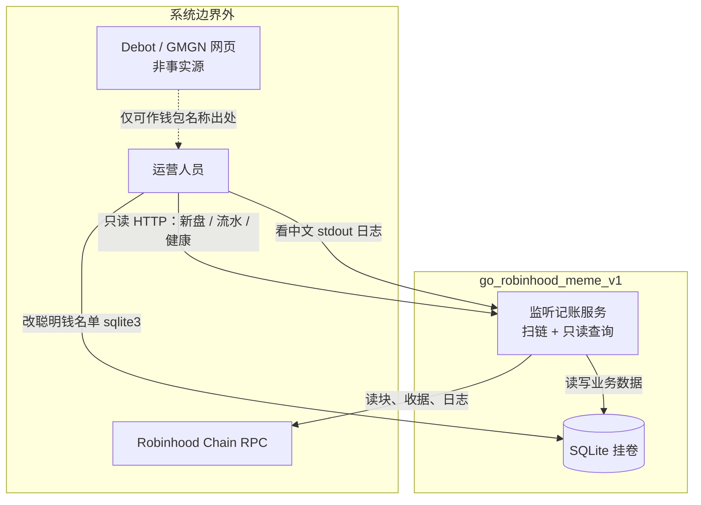

---

## 图 2 — 容器（C4 Container）

一个进程内的运行时容器：谁写库、谁只读。

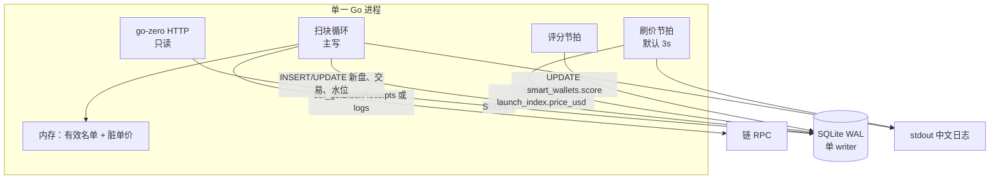

写路径必须汇到 **一个写连接 / 写队列**。HTTP 不得与扫块抢写。

---

## 图 3 — 组件与分层（C4 Component）

依赖只允许向下。`domain` 不碰 RPC/SQL。

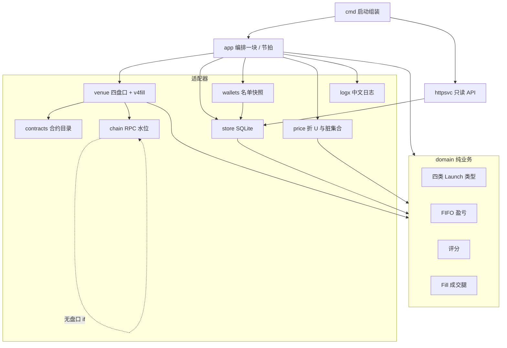

包路径与依赖禁则见 `01` §3。

---

## 图 4 — 部署（Docker）

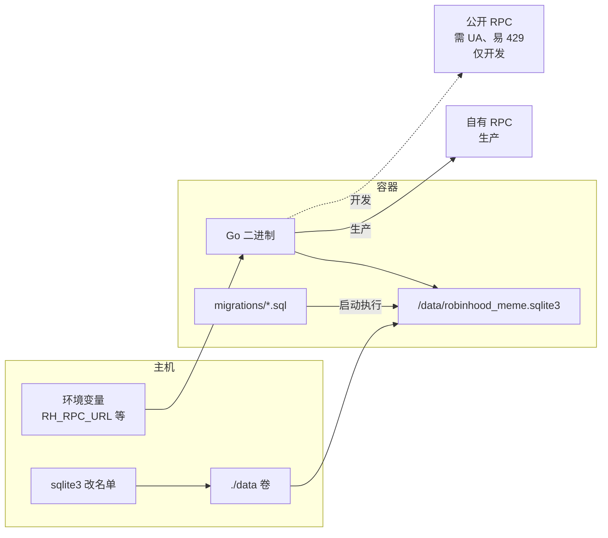

镜像不含密钥、不含 SQLite 数据文件。健康检查：进程 + 水位落后 + `/health`。

---

## 图 5 — 扫一块（运行时序）

```mermaid
sequenceDiagram
  participant Loop as 扫块循环
  participant Chain as chain
  participant WL as wallets
  participant Route as venue/route
  participant Ven as 盘口适配器
  participant Dom as domain
  participant Store as store
  participant Log as logx
  participant Dirty as price脏集合

  Loop->>Chain: 拉块收据
  Chain-->>Loop: receipts
  Loop->>WL: 刷新有效名单若过期
  loop 每条协议 log
    Loop->>Route: address + topic0
    alt 未登记
      Route-->>Loop: 忽略
    else 创建
      Route->>Ven: DecodeCreate
      Ven->>Store: launch_* + launch_index
      Ven->>Log: 新盘
      opt 创建人在有效名单
        Ven->>Store: wallet_events 发盘
        Ven->>Log: 聪明钱-发盘
      end
    else 成交 Fill
      Route->>Ven: DecodeFill 或 v4fill
      Ven->>Dirty: 已入库则记最新成交 U
      opt 用户在有效名单
        Ven->>Dom: FIFO 若卖出
        Ven->>Store: wallet_events
        Ven->>Log: 聪明钱-买/卖
      end
    end
  end
  Loop->>Store: 更新 sync_state
```

---

## 图 6 — 名单热更新

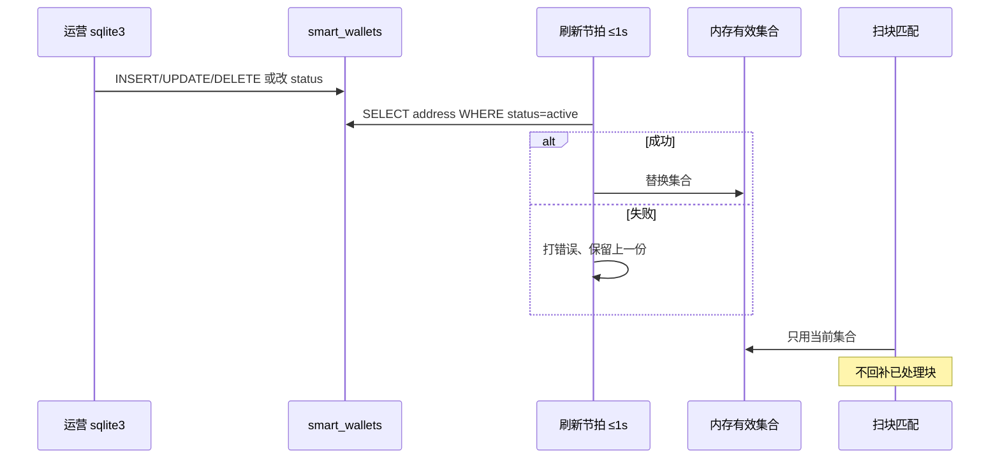

---

## 图 7 — 展示单价刷盘

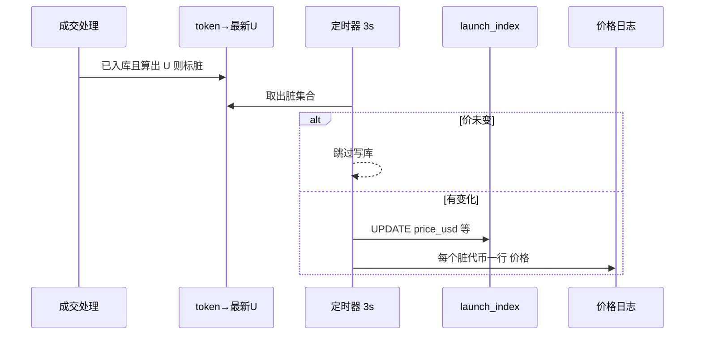

未成交代币不进入脏集合。明细表不写价格。

---

## 图 8 — 只读查询

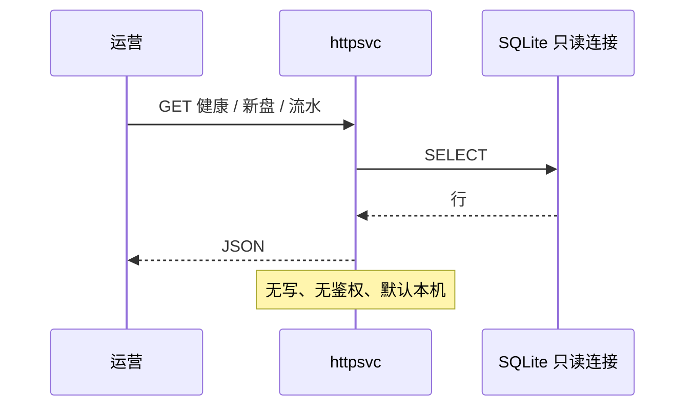

---

## 图 9 — 逻辑数据模型

物理 DDL 与列级定稿在 `docs/功能模块/`；本图约束主写与关系。

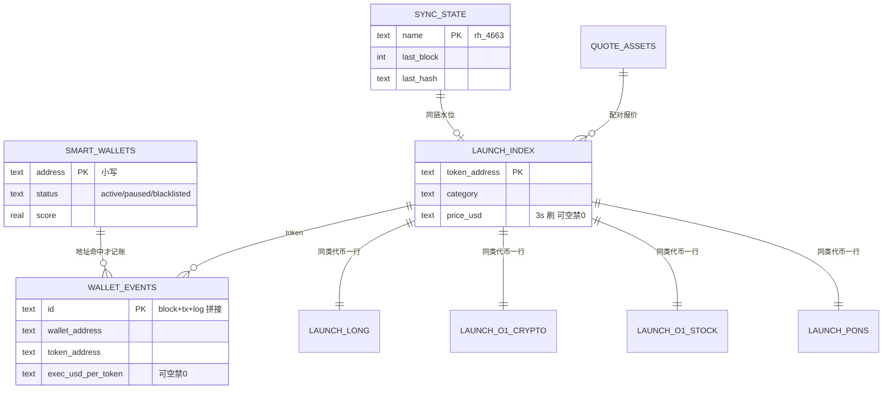

---

## 图 10 — 表主写归属

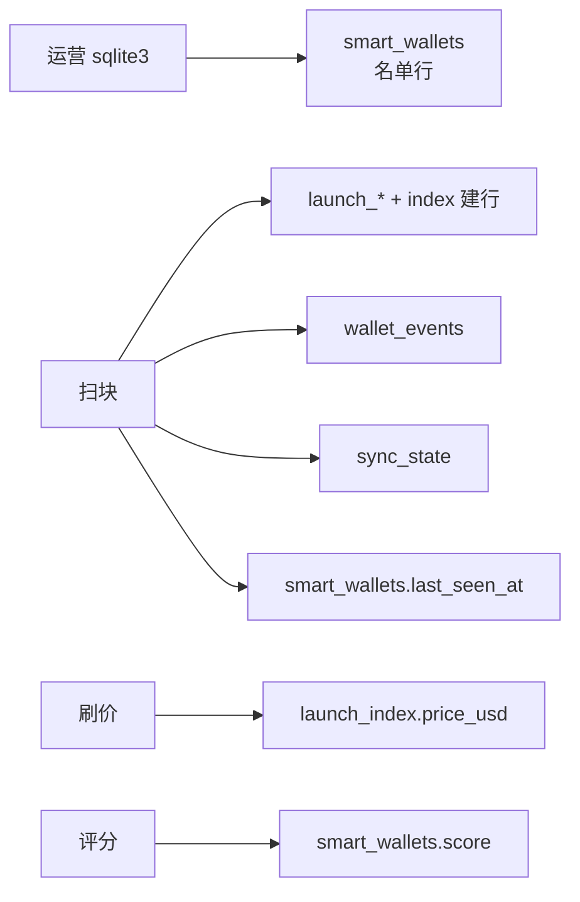

禁止 HTTP 写任何表。禁止刷价写 `wallet_events`。

---

## 图 11 — 合约目录分流（一块内每条 log）

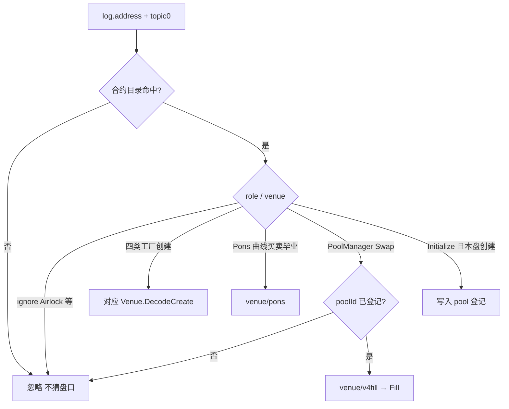

---

## 图 12 — 四类盘口与共享通道

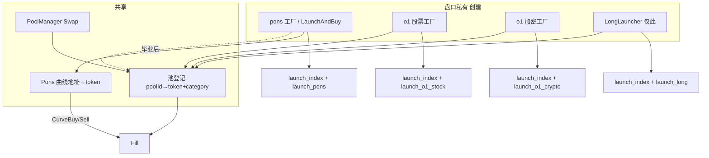

Airlock 不进入「创建」框。

---

## 图 13 — 失败与水位

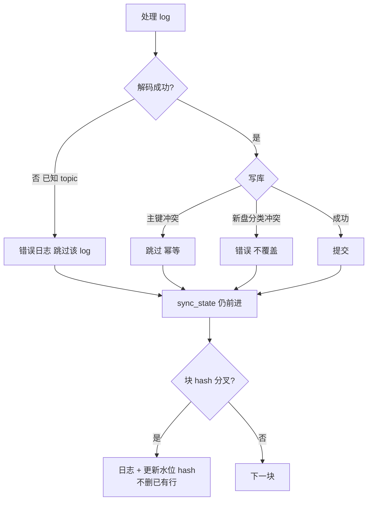

---

## 图 14 — 质量属性如何落地

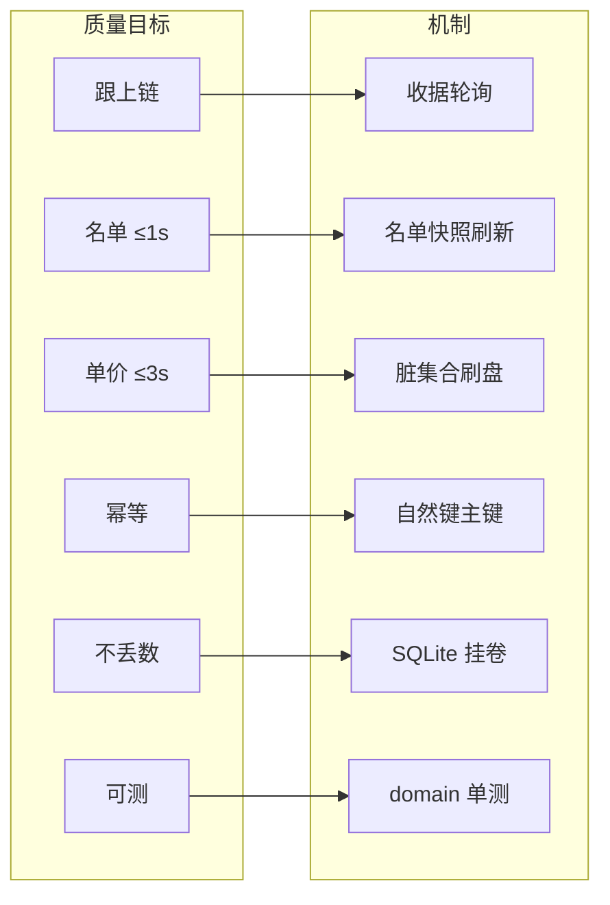
